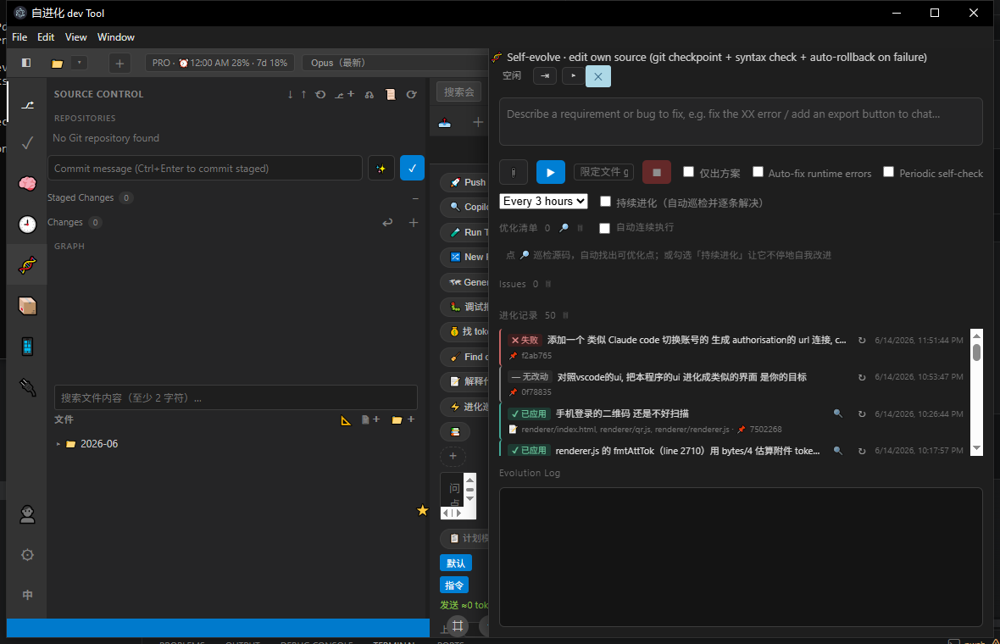

<h1 align="center">🧬 ievoide</h1>
<p align="center"><b>Your own self-made IDE — infinitely self-evolving, endlessly customizable.</b></p>
<p align="center">A Claude-powered desktop IDE you point at <i>itself</i>: ask for a feature, watch it build, commit, and ship it into its own source. Git is the undo button.</p>

> Built on the **[Claude Agent SDK](https://docs.claude.com/en/api/agent-sdk)**. Your dev tool, your rules — configure the model, prompts, permissions, and tools however you like.

<p align="center">
<a href="LICENSE"></a>
<a href="https://docs.claude.com/en/api/agent-sdk"></a>
<a href="https://www.electronjs.org/"></a>
</p>

<p align="center">English | <a href="README.zh-CN.md">简体中文</a></p>

---

## What is this?

**ievoide** is an Electron desktop app that wraps the Claude Agent SDK into a Claude-Code-style workspace. Everything lives in one portable folder — source, config, prompts, chat history, attachments — so you can copy it to another machine and keep going.

Its standout feature: **🧬 self-evolution** — point the agent at its *own* repo and it will implement new features, using git as a checkpoint/rollback safety net.


> A VS Code-style workspace: Source Control on the left, parallel chats on the right, with one-click actions — Push, Run Tests, New PR, Generate Codemap, Find dead code, and 🧬 evolve.

### 🧬 Self-evolution in action



> Describe a feature or bug, hit run, and the agent edits its own source behind a git checkpoint — syntax-checked, with **auto-rollback on failure**. Every attempt is logged as *applied / no-change / failed* with its commit hash. Toggle **持续进化 (continuous evolve)** to let it scan its own code and keep improving itself.

## Features

- **🧬 Self-evolution** — the app can modify its own source; git-backed checkpoints and rollback.
- **Parallel conversations** — run multiple chats at once, each with its own session.
- **Full Source Control** — built-in git diff/stage/commit UI.
- **Rich viewers/editors** — PDF, Markdown, and Mermaid diagrams, plus attachments.
- **Mobile remote access** — drive the agent from your phone (see [REMOTE-ACCESS.md](REMOTE-ACCESS.md)).
- **Token-aware** — per-turn input/output/cache-hit stats; model & thinking-effort switchers to save subscription usage.
- **Portable** — copy the folder, double-click to start; auto-runs `npm install` on first launch.

## Requirements

- [Node.js](https://nodejs.org/) (LTS)
- `git` (required for Source Control & self-evolution)
- A Claude account / API access for the [Claude Agent SDK](https://docs.claude.com/en/api/agent-sdk)

## Quick Start

```bash
git clone https://github.com/a21989s/ievoide.git
cd ievoide
npm install
npm start
```

Or double-click:
- **macOS** — `start.command`
- **Windows** — `start.bat`

> Cross-platform note: the code runs on macOS / Windows / Linux, but `node_modules` contains platform-specific Electron binaries. When moving between platforms, **don't** copy `node_modules` — let the first launch reinstall.

## Configuration

| File | Purpose |
|------|---------|
| `config.json` | System-prompt append, permission mode, model, thinking effort — edit directly |
| `mcp.json` | MCP server config (see `mcp.example.json`) |
| `data/` | Runtime data: chat history, attachments, settings (gitignored) |

Edit `systemPromptAppend` in `config.json` to customize the agent's default behavior/language.

### Self-evolution backend (the "brain")

The 🧬 self-evolution feature fetches its task/prompt from a small "brain" service in [`cloud/`](cloud/) (open-core split: the client only ever receives a single task + prompt; execution happens locally). All other features work without it.

To enable evolution, run the brain locally:

```bash
node cloud/brain.mjs        # listens on :8788 (override with BRAIN_PORT)
```

Then point the client at it in `config.json`:

```json
{ "brainUrl": "http://localhost:8788", "brainKey": "<your-key>" }
```

A dev key is auto-generated in `cloud/keys.json` on first run; in this repo the client picks it up automatically, so local setup is zero-config. Without a reachable brain (and no prior cache), only the evolution feature is unavailable — see [cloud/README.md](cloud/README.md) for the full protocol.

## ⚠️ Safety

This is an agentic tool with shell (Bash) access — Claude can read/write files and run commands in the directories you grant it.

- The shipped default is `permissionMode: "acceptEdits"` (auto-accepts file edits; still prompts for commands). For maximum safety set it to `"default"`; only use `"bypassPermissions"` if you fully understand the risk.
- **Self-evolution rewrites this app's own code** and relies on git for checkpoints/rollback — keep the working tree on a clean git repo before evolving.

## Contributing

Issues and PRs welcome — see [CONTRIBUTING.md](CONTRIBUTING.md).

## License

[MIT](LICENSE) © a21989s
