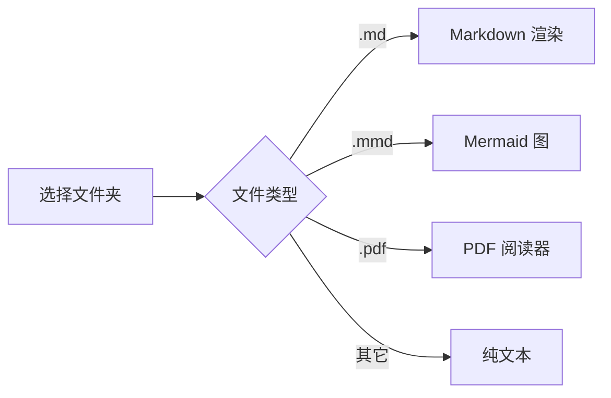

# 渲染测试

这是一段 **Markdown**，含 `行内代码`、列表和表格。

- 支持列表
- 支持 [链接](https://anthropic.com)

| 功能 | 状态 |
| ---- | ---- |
| Markdown | ✅ |
| Mermaid | ✅ |
| PDF | ✅ |

> 引用块示例

```js
console.log("代码块高亮区域");
```

## Mermaid 流程图


